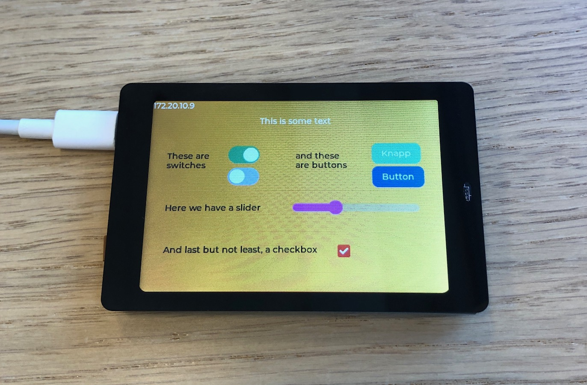

<div id="top" align="center">

[![Contributors][contributors-shield]][contributors-url]
[![Forks][forks-shield]][forks-url]
[![Stargazers][stars-shield]][stars-url]
[![Issues][issues-shield]][issues-url]
[![MIT License][license-shield]][license-url]
  
</div>

<!-- PROJECT LOGO -->
<br />
<div align="center">
  <a href="https://github.com/microgui/MicroGUI-Embedded">
    
  </a>

  <h3 align="center">MicroGUI Embedded</h3>

  <p align="center">
    Open-source software for deploying MicroGUI layouts on embedded displays.
    <br />
    <a href="https://github.com/microgui/MicroGUI-Embedded/wiki"><strong>Explore the docs »</strong></a>
    <br />
    <br />
    <a href="https://github.com/microgui/MicroGUI-Embedded/issues/new?labels=bug">Report Bug</a>
    ·
    <a href="https://github.com/microgui/MicroGUI-Embedded/issues/new?labels=enhancement">Request Feature</a>
  </p>
</div>

<!-- TABLE OF CONTENTS -->
<details>
  <summary>Table of Contents</summary>
  <ol>
    <li>
      <a href="#about-the-project">About The Project</a>
    </li>
    <li>
      <a href="#getting-started">Getting Started</a>
      <ul>
        <li><a href="#prerequisites">Prerequisites</a></li>
        <li><a href="#installation">Installation</a></li>
      </ul>
    </li>
    <li>
      <a href="#usage">Usage</a>
      <ul>
        <li><a href="#tutorial">Tutorial</a></li>
        <li><a href="#examples">Examples</a></li>
        <li><a href="#api">API</a></li>
      </ul>
    </li>
    <li><a href="#contributing">Contributing</a></li>
    <li><a href="#license">License</a></li>
  </ol>
</details>

<!-- ABOUT THE PROJECT -->
# About The Project
<div align='center'>
<a>
  
</a>
</div>

Use this software to deploy your [MicroGUI](https://github.com/microgui/MicroGUI) layout on embedded displays. Monitor and control your displays remotely by connecting them to your WiFi.


<p align="right">(<a href="#top">back to top</a>)</p>

<!-- GETTING STARTED -->
# Getting Started

## Prerequisites

Any of the below listed embedded displays:
  * WT32-SC01

`There is currently only support for the WT32-SC01, however the vision is to implement support for many more displays in the future.`

Download and install the [PlatformIO](https://platformio.org/platformio-ide) extension for [VS Code](https://code.visualstudio.com/) if you haven't already.


## Installation

1. Create a new PlatformIO project and select `Espressif ESP32 Dev Module` as development board. Make sure that Arduino is set as framework. For detailed instructions, look [here](https://docs.platformio.org/en/stable/tutorials/espressif32/arduino_debugging_unit_testing.html).
2. Open the `platformio.ini` and paste the following:
   ```sh
    [env:esp32dev]
    platform = https://github.com/platformio/platform-espressif32.git
    board = esp32dev
    framework = arduino
    platform_packages =
        framework-arduinoespressif32 @ https://github.com/espressif/arduino-esp32#master
    upload_speed = 921600
    monitor_speed = 115200
    lib_deps = 
        https://github.com/microgui/MicroGUI-Embedded.git
   ```
   This makes sure that you use the latest Arduino core for the ESP32 as well as adds MicroGUI-Embedded to the list of library dependencies.
3. That should be all, you are now ready to use MicroGUI and deploy your GUIs on embedded displays. Have a look at the tutorial and some of the examples to learn how to use this library. Also check out the API documentation for more details on library functions.
4. Have fun!

<p align="right">(<a href="#top">back to top</a>)</p>

<!-- USAGE -->
# Usage

## Tutorial

## Examples

## API


<p align="right">(<a href="#top">back to top</a>)</p>

<!-- CONTRIBUTING -->
# Contributing

Contributions are what make the open source community such an amazing place to learn, inspire, and create. Any contributions you make are **greatly appreciated**.

If you have a suggestion that would make this better, please fork the repo and create a pull request. You can also simply open an issue with the tag "enhancement".
Don't forget to give the project a star! Thanks again!

1. Fork the Project
2. Create your Feature Branch (`git checkout -b feature/AmazingFeature`)
3. Commit your Changes (`git commit -m 'Add some AmazingFeature'`)
4. Push to the Branch (`git push origin feature/AmazingFeature`)
5. Open a Pull Request

<p align="right">(<a href="#top">back to top</a>)</p>

<!-- LICENSE -->
# License

Distributed under the MIT License. See `LICENSE.md` for more information.

<p align="right">(<a href="#top">back to top</a>)</p>


<!-- MARKDOWN LINKS & IMAGES -->
<!-- https://www.markdownguide.org/basic-syntax/#reference-style-links -->
[contributors-shield]: https://img.shields.io/github/contributors/microgui/MicroGUI-Embedded.svg?style=for-the-badge
[contributors-url]: https://github.com/microgui/MicroGUI-Embedded/graphs/contributors
[forks-shield]: https://img.shields.io/github/forks/microgui/MicroGUI-Embedded.svg?style=for-the-badge
[forks-url]: https://github.com/microgui/MicroGUI-Embedded/network/members
[stars-shield]: https://img.shields.io/github/stars/microgui/MicroGUI-Embedded.svg?style=for-the-badge
[stars-url]: https://github.com/microgui/MicroGUI-Embedded/stargazers
[issues-shield]: https://img.shields.io/github/issues/microgui/MicroGUI-Embedded.svg?style=for-the-badge
[issues-url]: https://github.com/microgui/MicroGUI-Embedded/issues
[license-shield]: https://img.shields.io/github/license/microgui/MicroGUI-Embedded.svg?style=for-the-badge
[license-url]: https://github.com/microgui/MicroGUI-Embedded/blob/main/LICENSE.md
[product-screenshot]: images/canvas.png
