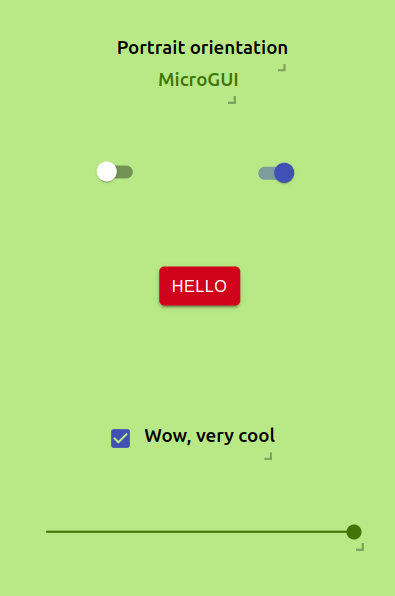

<div id="top" align="center">

[![Contributors][contributors-shield]][contributors-url]
[![Forks][forks-shield]][forks-url]
[![Stargazers][stars-shield]][stars-url]
[![Issues][issues-shield]][issues-url]
[![MIT License][license-shield]][license-url]
  
</div>

<!-- PROJECT LOGO -->
<br />
<div align="center">
  <a href="https://github.com/microgui/MicroGUI-Embedded">
    
  </a>

  <h3 align="center">MicroGUI Embedded</h3>

  <p align="center">
    Open-source Arduino library for deploying GUIs created with MicroGUI on embedded displays.
    <br />
    <a href="https://github.com/microgui/MicroGUI-Embedded/wiki"><strong>Explore the docs »</strong></a>
    <br />
    <br />
    <a href="https://github.com/microgui/MicroGUI-Embedded/issues/new?labels=bug">Report Bug</a>
    ·
    <a href="https://github.com/microgui/MicroGUI-Embedded/issues/new?labels=enhancement">Request Feature</a>
  </p>
</div>

<!-- TABLE OF CONTENTS -->
<details>
  <summary>Table of Contents</summary>
  <ol>
    <li>
      <a href="#about-the-project">About The Project</a>
    </li>
    <li>
      <a href="#getting-started">Getting Started</a>
      <ul>
        <li><a href="#prerequisites">Prerequisites</a></li>
        <li><a href="#installation">Installation</a></li>
      </ul>
    </li>
    <li>
      <a href="#usage">Usage</a>
      <ul>
        <li><a href="#tutorial">Tutorial</a></li>
        <li><a href="#examples">Examples</a></li>
        <li><a href="#api">API</a></li>
      </ul>
    </li>
    <li><a href="#contributing">Contributing</a></li>
    <li><a href="#license">License</a></li>
  </ol>
</details>

<!-- ABOUT THE PROJECT -->
## About The Project
<div align='center'>
  <a>
    
  </a>
</div>

The main purpose of MicroGUI is to offer a convenient solution for makers to implement touch displays in their embedded projects. This library is supposed to be used together with the [web application](https://github.com/microgui/MicroGUI) to enable rapid prototyping of your own GUI.

MicroGUI-Embedded takes care of making your GUI work on embedded displays with minimal coding from your part, so that you can focus on the project at hand instead of having to learn how to program displays. You will also be able to monitor and control your displays remotely by connecting them to your WiFi. Read more about this in the following sections.


<p align="right">(<a href="#top">back to top</a>)</p>

<!-- GETTING STARTED -->
## Prerequisites

* Any of the below listed embedded displays:
  * WT32-SC01

* IDE (Integrated Development Environment)
    * It is recommended to use the [PlatformIO](https://platformio.org/platformio-ide) extension for [VS Code](https://code.visualstudio.com/) to program your embedded display for use with MicroGUI. The installation instructions below are for PlatformIO, but you can install this library in [Arduino IDE](https://www.arduino.cc/en/software) as well if you would prefer that.


## Installation
Note: These instructions are specific to the WT32-SC01 display. As more displays are supported by MicroGUI in the future, this section will most likely change.
### New project:
1. Create a new PlatformIO project and select `Espressif ESP32 Dev Module` as development board. Make sure that Arduino is set as framework. For detailed instructions, look [here](https://docs.platformio.org/en/stable/tutorials/espressif32/arduino_debugging_unit_testing.html).
2. Open the `platformio.ini` and paste the following:
   ```ini
    [env:esp32dev]
    platform = https://github.com/platformio/platform-espressif32.git
    board = esp32dev
    framework = arduino
    platform_packages = framework-arduinoespressif32 @ https://github.com/espressif/arduino-esp32#master
    upload_speed = 921600
    monitor_speed = 115200
    lib_deps = https://github.com/microgui/MicroGUI-Embedded.git
   ```
   This makes sure that you use the latest Arduino core for the ESP32 as well as adds MicroGUI-Embedded to the list of library dependencies.
3. That should be all, have fun!

### Existing project:
1. Simply add MicroGUI-Embedded to your library dependencies, like this: 
   ```ini
    lib_deps = https://github.com/microgui/MicroGUI-Embedded.git
   ```
2. Done, enjoy!

<p align="right">(<a href="#top">back to top</a>)</p>

<!-- USAGE -->
## Tutorial
One of the many beauties of MicroGUI 😉 is the fact that you **DO NOT** have to touch any code to get started with making and testing your GUIs. Sure, you have to copy & paste some code as well as upload it to your display, but you don't have to do any coding yourself. Follow the steps below to see how easy MicroGUI is to use.
### **First test**
After you've installed both the MicroGUI web application and this library, you are set to create and deploy GUIs.

However, as a quick first test to see that the library installation was successful, copy the template below into your main sketch. Hit upload and wait for it to finish. The default GUI should appear prompting you to continue reading the tutorials.

### Default GUI
<div align='center'>
  <a>
    
  </a>
  <p>This is the GUI which is rendered by default.</p>
</div>

### Template
This is all the boilerplate code needed to run MicroGUI Embedded. You can continue using this template as a base for any new projects you create with MicroGUI.
```cpp
#include <MicroGUI.h>
//#include <RemoteMicroGUI.h>     // Uncomment if you want to use MicroGUI Remote features

void setup() {
  //Serial.begin(115200);         // Recommended! MicroGUI will print useful messages

  mgui_init();
  //mgui_remote_init();           // Uncomment if you want to use MicroGUI Remote features
}

void loop() {
  MGUI_event * latest = mgui_run();
}
```


### **Second test**
After you've seen that this works, test the MicroGUI Remote features by uncommenting the commented out lines of the template. Once the display is programmed you will be presented with the same default GUI except for this time you will see a red border indicating that the display is not connected to any WiFi network. The display is now in AP (access point) mode, meaning you can connect to it like any other WiFi network. 

When you connect to the display's AP, either with your computer or mobile phone, you will be served a captive portal where you can enter WiFi network credentials for the display to connect to. Note: If the captive portal does not appear, browse to [http://192.168.4.1/](http://192.168.4.1/) to enter the same portal for entering your WiFi network credentials.

Once you've entered your WiFi network credentials and click the 'Submit' button, the display will start trying to connect to the provided network. If successful, the display will switch to stationary mode, meaning the access point closes.

At this point, you are ready to use MicroGUI Remote features including remote monitoring and control as well as GUI upload which you can find in the web application. Your display's IP adress will be displayed on the screen.

<p align="right">(<a href="#top">back to top</a>)</p>


## Examples

The examples located in the "[examples](https://github.com/microgui/MicroGUI-Embedded/tree/main/examples)" folder are there to demonstrate how MicroGUI can be used.

In order to test an example, simply copy the example code into your own main sketch and upload it to your display.

<div align='center' style='display:flex; justify-content:center;'>
  <div style='margin: auto 10px'>
    
    <p>Example 1</p>
  </div>
  <div style='margin: auto 10px'>
    
    <p>Example 2</p>
  </div>
</div>

<p align="right">(<a href="#top">back to top</a>)</p>


## User API
Short explanations of all user available MicroGUI functions. Have a look at the examples to better understand how and where to use them.
### **MicroGUI Base**
The "Base" API documentation is a reference to functions available to the user in the MicroGUI Embedded library without any other MicroGUI extensions.

#### **Initialization of MicroGUI**

There are three ways of initializing MicroGUI Embedded to allow for either more or less advanced usage of the library.

**Without any parameters**

This will render either a GUI stored in flash or the default GUI if flash is empty.
```cpp
void mgui_init();
```

**With a hard-coded GUI stored as a string**

Initializing like this will always render the hard-coded GUI on reboot.
```cpp
void mgui_init(char json[]);
```

**With a hard-coded GUI stored as a string & setting display orientation**

This gives the option of setting display orientation.
```cpp
void mgui_init(char json[], int rotation);
```
There are four different orientations in which the display can be set in. It is recommended to use this typedef:
```cpp
typedef enum {
  MGUI_PORTRAIT,
  MGUI_LANDSCAPE,
  MGUI_PORTRAIT_FLIPPED,
  MGUI_LANDSCAPE_FLIPPED  
}MGUI_orientation;
```
Example:
```cpp
char json[] = "...{MicroGUI JSON string}...";
mgui_init(json, MGUI_LANDSCAPE_FLIPPED);
```

#### **MicroGUI Run**

Takes care of updating the GUI.

This needs to be placed inside of the loop in order for the GUI to update. The function returns an object pointer to an MGUI_event, which holds information on which object triggered the event, an event id/type as well as a value associated with the event. Take care of this event to make stuff happen on display events.
```cpp
MGUI_event * mgui_run();
```

#### **Compare two strings**

Compares two strings and returns true if they have the same content. Useful for taking care of MGUI events, see examples.
```cpp
bool mgui_compare(const char * string1, const char * string2);
```

#### **Setting a value to an on-screen object**

```cpp
void mgui_set_value(const char * obj_name, int value);
```

#### **Setting the text of a label/textfield**

```cpp
void mgui_set_text(const char * obj_name, const char * text);
```

#### **Getting the value to an on-screen object**
```cpp
int mgui_get_value(const char * obj_name);
```


<p align="right">(<a href="#top">back to top</a>)</p>


### **MicroGUI Remote**
The "Remote" API documentation is a reference to functions available to the user in the MicroGUI Remote extension.

#### **Initialization of MicroGUI Remote extension**

**Without any parameters**

No hard-coded WiFi credentials.
```cpp
void mgui_remote_init();
```

**With the name of a label**

No hard-coded WiFi credentials. Will set a label/textfield to show the display's IP address. 
```cpp
void mgui_remote_init(const char * textfield);
```

**With hard-coded WiFi credentials**

Works great if you are 100% certain of the available WiFi networks wherever you are putting your display. Will always try to connect to this network on reboot.
```cpp
void mgui_remote_init(const char * ssid, const char * password);
```

**With hard-coded WiFi credentials and the name of a label**

Hard-coded WiFi credentials and sets a label/textfield to show the display's IP address.
```cpp
void mgui_remote_init(const char * ssid, const char * password, const char * textfield);
```


<p align="right">(<a href="#top">back to top</a>)</p>


<!-- CONTRIBUTING -->
## Contributing

Contributions are what make the open source community such an amazing place to learn, inspire, and create. Any contributions you make are **greatly appreciated**.

If you have a suggestion that would make this better, please fork the repo and create a pull request. You can also simply open an issue with the tag "enhancement".
Don't forget to give the project a star! Thanks again!

1. Fork the Project
2. Create your Feature Branch (`git checkout -b feature/AmazingFeature`)
3. Commit your Changes (`git commit -m 'Add some AmazingFeature'`)
4. Push to the Branch (`git push origin feature/AmazingFeature`)
5. Open a Pull Request

<p align="right">(<a href="#top">back to top</a>)</p>

<!-- LICENSE -->
## License

Distributed under the MIT License. See `LICENSE.md` for more information.

<p align="right">(<a href="#top">back to top</a>)</p>


<!-- MARKDOWN LINKS & IMAGES -->
<!-- https://www.markdownguide.org/basic-syntax/#reference-style-links -->
[contributors-shield]: https://img.shields.io/github/contributors/microgui/MicroGUI-Embedded.svg?style=for-the-badge
[contributors-url]: https://github.com/microgui/MicroGUI-Embedded/graphs/contributors
[forks-shield]: https://img.shields.io/github/forks/microgui/MicroGUI-Embedded.svg?style=for-the-badge
[forks-url]: https://github.com/microgui/MicroGUI-Embedded/network/members
[stars-shield]: https://img.shields.io/github/stars/microgui/MicroGUI-Embedded.svg?style=for-the-badge
[stars-url]: https://github.com/microgui/MicroGUI-Embedded/stargazers
[issues-shield]: https://img.shields.io/github/issues/microgui/MicroGUI-Embedded.svg?style=for-the-badge
[issues-url]: https://github.com/microgui/MicroGUI-Embedded/issues
[license-shield]: https://img.shields.io/github/license/microgui/MicroGUI-Embedded.svg?style=for-the-badge
[license-url]: https://github.com/microgui/MicroGUI-Embedded/blob/main/LICENSE.md
[product-screenshot]: images/canvas.png
